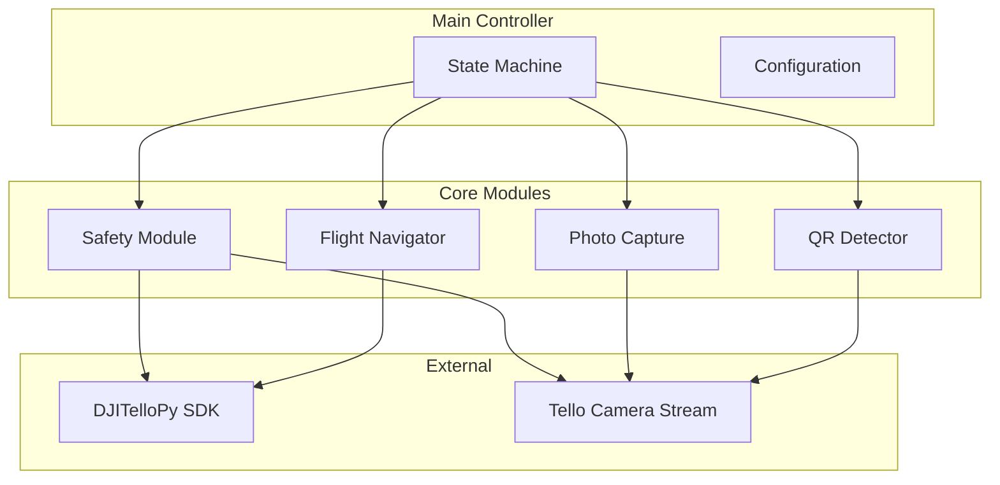
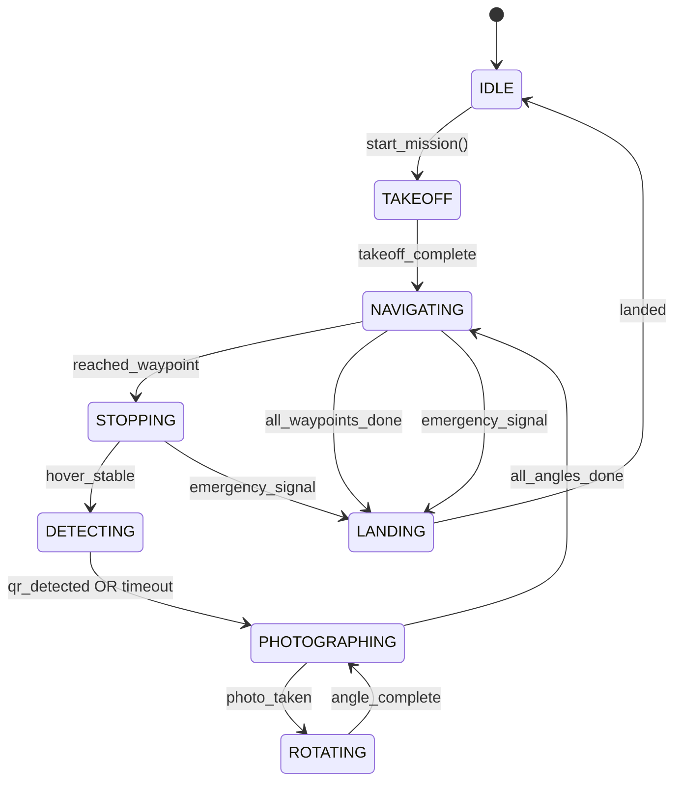

# Tello Drone Photography System for Steel Structure Documentation

Automated drone photography system using a DJI Tello to document work progress on steel structures in an indoor workshop. The system navigates pre-programmed waypoints, detects structures via QR codes, and captures multi-angle photos organized by date and structure ID.

## Project Specifications

| Parameter | Value |
|-----------|-------|
| **Environment** | Indoor workshop, 100m × 30m |
| **Drone** | Standard DJI Tello |
| **MVP Scope** | 3 stopping points, 10m apart (~20m path) |
| **Detection Method** | QR codes on/near structures |
| **Photos per Stop** | 3 angles (front, left 45°, right 45°) |
| **Emergency Signal** | Crossed arms (X gesture) |
| **QR Fail Behavior** | Skip, log, continue |

---

## Architecture Overview



### State Machine Flow



---

## Proposed File Structure

```
c:\Users\arne_r\drone_photo_taking\
├── DJITelloPy/                    # Cloned SDK (reference)
├── draw-tello-path-YOLOv8/        # Cloned reference
├── computer_vision_with_tello_drone/  # Cloned reference
│
├── src/                           # [NEW] Main application
│   ├── __init__.py
│   ├── main.py                    # Entry point
│   ├── config.py                  # Configuration management
│   ├── state_machine.py           # Mission state orchestration
│   │
│   ├── modules/
│   │   ├── __init__.py
│   │   ├── flight_navigator.py    # Waypoint navigation
│   │   ├── qr_detector.py         # QR code detection
│   │   ├── photo_capture.py       # Multi-angle photography
│   │   └── safety.py              # Obstacle detection + hand gesture
│   │
│   └── utils/
│       ├── __init__.py
│       ├── logger.py              # Logging utilities
│       └── storage.py             # Photo storage management
│
├── config/                        # [NEW] Configuration files
│   ├── mission_default.yaml       # Default mission parameters
│   └── waypoints_mvp.yaml         # MVP 3-waypoint definition
│
├── photos/                        # [NEW] Photo output directory
│   └── .gitkeep
│
├── tests/                         # [NEW] Test suite
│   ├── test_qr_detector.py
│   ├── test_photo_capture.py
│   └── test_safety.py
│
├── requirements.txt               # [NEW] Python dependencies
└── README.md                      # [NEW] Project documentation
```

---

## Proposed Changes

### Core Application

#### [NEW] [requirements.txt](file:///c:/Users/arne_r/drone_photo_taking/requirements.txt)
Python dependencies:
- `djitellopy` — Tello SDK
- `opencv-python` — Image processing & video stream
- `pyzbar` — QR code detection
- `mediapipe` — Hand/pose detection for emergency gesture
- `pyyaml` — Configuration parsing
- `numpy` — Array operations

---

#### [NEW] [config.py](file:///c:/Users/arne_r/drone_photo_taking/src/config.py)
Centralized configuration management:
- Load mission parameters from YAML
- Waypoint definitions (X, Y, Z coordinates)
- Photo settings (angles, delay between shots)
- Safety thresholds (obstacle distance, gesture confidence)

---

#### [NEW] [state_machine.py](file:///c:/Users/arne_r/drone_photo_taking/src/state_machine.py)
Mission orchestration using state pattern:
- States: `IDLE`, `TAKEOFF`, `NAVIGATING`, `STOPPING`, `DETECTING`, `PHOTOGRAPHING`, `ROTATING`, `LANDING`
- Transitions based on module callbacks
- Emergency override from safety module

---

### Flight Navigation Module

#### [NEW] [flight_navigator.py](file:///c:/Users/arne_r/drone_photo_taking/src/modules/flight_navigator.py)
Waypoint navigation:
- Load waypoints from config
- Calculate relative movements between points
- Execute movement commands via DJITelloPy
- Position tracking (using Tello's internal estimation)
- Callback on waypoint reached

**Key Methods:**
```python
class FlightNavigator:
    def load_waypoints(self, config_path: str) -> None
    def navigate_to_next(self) -> bool
    def get_current_position(self) -> Tuple[int, int, int]
    def has_more_waypoints(self) -> bool
```

---

### QR Detection Module

#### [NEW] [qr_detector.py](file:///c:/Users/arne_r/drone_photo_taking/src/modules/qr_detector.py)
Structure identification via QR codes:
- Continuous frame analysis from video stream
- Decode QR using `pyzbar`
- Extract structure ID from QR data
- Timeout handling (return `UNKNOWN` after N seconds)

**Key Methods:**
```python
class QRDetector:
    def start_detection(self) -> None
    def get_detected_id(self, timeout_sec: float = 3.0) -> Optional[str]
    def stop_detection(self) -> None
```

---

### Photo Capture Module

#### [NEW] [photo_capture.py](file:///c:/Users/arne_r/drone_photo_taking/src/modules/photo_capture.py)
Multi-angle photography:
- Capture frame from video stream
- Save with structured naming: `{date}/{structure_id}/stop{N}_{angle}.jpg`
- Angle sequence: front → rotate left 45° → photo → rotate right 90° → photo
- Return to original heading after capture

**Key Methods:**
```python
class PhotoCapture:
    def capture_all_angles(self, structure_id: str, stop_number: int) -> List[str]
    def set_output_directory(self, path: str) -> None
```

**Photo Naming Convention:**
```
photos/2026-01-03/STRUCTURE_A1/stop1_front.jpg
photos/2026-01-03/STRUCTURE_A1/stop1_left45.jpg
photos/2026-01-03/STRUCTURE_A1/stop1_right45.jpg
```

---

### Safety Module

#### [NEW] [safety.py](file:///c:/Users/arne_r/drone_photo_taking/src/modules/safety.py)
Dual-purpose safety system:

**1. Obstacle Avoidance:**
- Analyze video frames for obstacles ahead
- Simple approach: detect large contours/changes in specific regions
- Pause navigation if obstacle detected, resume when clear
- *Note: Tello lacks depth sensors, so this is vision-based estimation*

**2. Emergency Hand Gesture (Crossed Arms X):**
- Use MediaPipe Pose detection
- Detect crossed arms pattern (wrists crossing opposite shoulders)
- Trigger immediate landing when detected with high confidence

**Key Methods:**
```python
class SafetyModule:
    def start_monitoring(self) -> None
    def stop_monitoring(self) -> None
    def is_emergency_triggered(self) -> bool
    def is_obstacle_ahead(self) -> bool
    def set_emergency_callback(self, callback: Callable) -> None
```

---

### Configuration Files

#### [NEW] [mission_default.yaml](file:///c:/Users/arne_r/drone_photo_taking/config/mission_default.yaml)
```yaml
flight:
  takeoff_height_cm: 100
  movement_speed: 50  # 10-100
  hover_stability_delay_sec: 2.0

photo:
  angles: ["front", "left45", "right45"]
  rotation_degrees: 45
  delay_between_shots_sec: 1.0
  output_directory: "./photos"

detection:
  qr_timeout_sec: 3.0
  fallback_id: "UNKNOWN"

safety:
  obstacle_check_enabled: true
  obstacle_threshold: 0.3  # frame coverage ratio
  gesture_confidence_threshold: 0.7
  emergency_gesture: "crossed_arms"
```

#### [NEW] [waypoints_mvp.yaml](file:///c:/Users/arne_r/drone_photo_taking/config/waypoints_mvp.yaml)
```yaml
# MVP: 3 waypoints, 10m apart along X axis
# Coordinates relative to takeoff point (cm)
waypoints:
  - name: "Stop 1"
    x: 0
    y: 0
    z: 100  # height

  - name: "Stop 2"  
    x: 1000  # 10m forward
    y: 0
    z: 100

  - name: "Stop 3"
    x: 2000  # 20m forward
    y: 0
    z: 100

return_home: true
```

---

## Implementation Order

> [!IMPORTANT]
> Recommended build sequence to enable incremental testing:

### Phase 1: Foundation
1. **Project setup** — Create directory structure, `requirements.txt`, install dependencies
2. **Config system** — `config.py` + YAML files
3. **Logger utility** — `utils/logger.py`

### Phase 2: Core Modules (testable independently)
4. **QR Detector** — Test with webcam/static images first
5. **Photo Capture** — Test saving frames locally
6. **Safety Module** — Test gesture detection without drone
7. **Flight Navigator** — Test with drone in small space

### Phase 3: Integration
8. **State Machine** — Wire all modules together
9. **Main entry point** — `main.py` with CLI

### Phase 4: Testing & Polish
10. **Unit tests** for each module
11. **Integration test** — Single waypoint mission
12. **Full MVP test** — 3 waypoint mission

---

## Verification Plan

### Automated Tests
```bash
# Run unit tests
pytest tests/ -v

# Test QR detection with sample images
python -m src.modules.qr_detector --test-image samples/qr_sample.png

# Test gesture detection with webcam
python -m src.modules.safety --test-gesture
```

### Manual Verification
1. **Drone connection test** — Confirm DJITelloPy can connect and receive video stream
2. **Single waypoint test** — Takeoff → fly 2m → land
3. **QR detection live test** — Hold QR code in front of hovering drone
4. **Emergency gesture test** — Trigger crossed arms during hover
5. **Full MVP run** — Execute complete 3-stop mission

---

## Dependencies & Environment

| Dependency | Version | Purpose |
|------------|---------|---------|
| Python | 3.8+ | Runtime |
| djitellopy | 2.5+ | Tello SDK |
| opencv-python | 4.8+ | Video processing |
| pyzbar | 0.1.9+ | QR decoding |
| mediapipe | 0.10+ | Pose detection |
| pyyaml | 6.0+ | Config parsing |
| pytest | 7.0+ | Testing |

---

## Risks & Mitigations

| Risk | Likelihood | Impact | Mitigation |
|------|------------|--------|------------|
| **Position drift** (Tello has no GPS indoors) | High | Medium | Use QR codes as visual checkpoints; accept ~1m tolerance |
| **Obstacle detection false positives** | Medium | Low | Conservative thresholds; manual override via keyboard |
| **Gesture detection in low light** | Medium | Medium | Test lighting conditions; consider LED markers on arms |
| **Battery drain during testing** | High | Low | Multiple batteries; implement battery check before mission |

---

## Future Enhancements (Post-MVP)

- [ ] GUI for waypoint definition (draw path on floorplan)
- [ ] Visual SLAM for better position tracking
- [ ] Structure recognition (train YOLO model on steel components)
- [ ] Cloud upload integration
- [ ] Multiple drone coordination
- [ ] Automated scheduling
